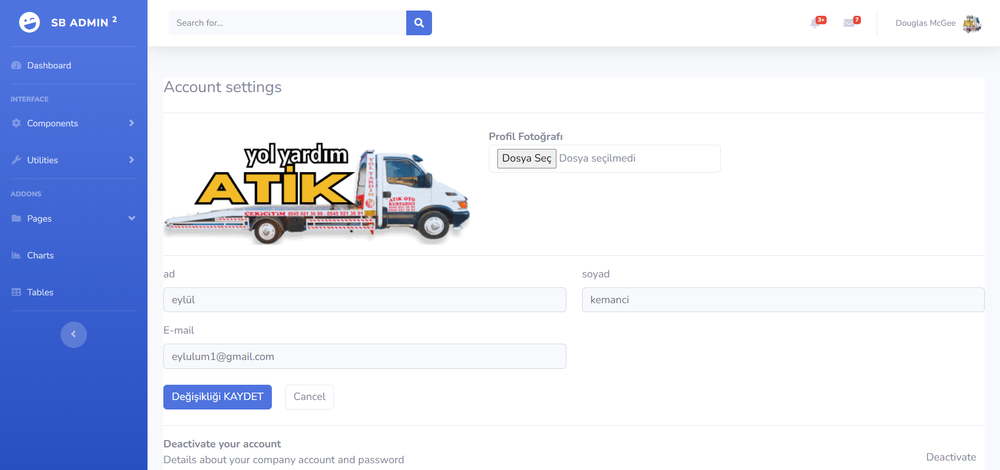

# ***NODEJS =CRUD-AUTHENTİCATİON-SOCİAL MEDİA AUTH= TAMPLATE***

  

<b>-> Bu proje CRUD işlemlerini, giriş ve güvenlik işlemlerini, Sosyal medya hesaplarıyla giriş ve güvenlik işlemlerini zaman kaybetmeden kullanabilmemizi sağlayan proje tamplate yapısını sunar bize. </b>
  

-> Bu proje NODE-JS ile yapılmıştır.. 
-> Veritabanı bilgileri config dosyasına eklenmeniz yeterlidir! 
-> Aktif olarak email-şifre yöntemi kullanılmaktadır.! 
-> Email aktifleştirme şartı vardır üye girişi için! 
-> Email aktifleştirme linki gönderilir mail adresine! 
-> Adminler admin maili eklemelidir ".env" dosyasına! 
-> Token kontrolü yapılmaktadır!
 

 
 

    <h6>Giris Sayfası:</h6> 
      
    <h6>Üye Ol Sayfası:</h6> 
      
    <h6>Admin Sayfası:</h6> 
      

